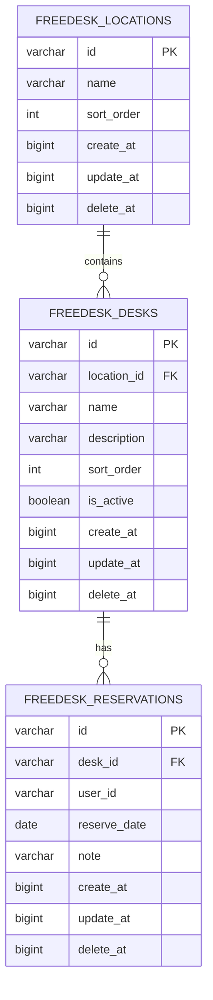

# DB 設計書

## ドキュメント情報

| 項目 | 内容 |
|------|------|
| プロジェクト名 | Mattermost Free Desk Reservation Plugin |
| 推奨リポジトリ名 | `mattermost-plugin-freedesk` |
| プラグイン ID | `com.github.taku-devjp.freedesk` |
| バージョン | 0.1.0 |
| 作成日 | 2026-08-06 |
| ステータス | 確定 |
| 参照 | [要件定義書](./requirements.md)、[API 設計書](./api-design.md) |

---

## 1. 概要

### 1.1 目的

本ドキュメントは、フリーデスク予約プラグインが Mattermost サーバーのデータベース上に作成する専用テーブルの設計を定義する。要件定義書（FR-001〜FR-053、NFR-001〜NFR-031）に準拠する。

### 1.2 ストレージ方針

| 項目 | 方針 |
|------|------|
| 保存先 | Mattermost Server DB（MySQL / PostgreSQL / SQLite） |
| アクセス方法 | Mattermost Plugin API（`pluginapi` の Store / Driver） |
| マイグレーション | プラグイン `OnActivate` 時にバージョン管理付きで実行 |
| KV Store | 設定キャッシュ等の軽量データのみ（本番データは SQL テーブル） |

**KV Store を本データに使わない理由**

- 1 キー 64KB 制限があり、マトリクス全件の取得・日付範囲検索に不向き
- 日付・デスク単位のクエリ、ユニーク制約による排他制御が SQL の方が適切

### 1.3 日付・タイムゾーン

| 項目 | 方針 |
|------|------|
| タイムゾーン | **Asia/Tokyo 固定**（FR-050） |
| 「今日」の境界 | Asia/Tokyo の **0:00**（FR-051） |
| `reserve_date` | カレンダー日（`DATE` 型）。アプリ層で Asia/Tokyo の日付として解釈・生成する |
| 表示・予約可能期間 | 同一。「今日」から約 2 か月先まで（FR-011。日数はプラグイン設定 `MaxAdvanceDays` で変更可） |
| 昨日以前 | マトリクス表示は可、予約・取消は不可（FR-052） |

### 1.4 命名規則

- テーブル名：`freedesk_{entity}`（プラグイン ID による名前空間を避け、可読性を優先）
- 主キー：`VARCHAR(26)` — ULID 形式（Mattermost の `model.NewId()` 互換）
- タイムスタンプ：Unix ミリ秒（`BIGINT`）、Mattermost 慣習に合わせる
- 論理削除：`delete_at` カラム（`0` = 有効、`> 0` = 削除日時 ms）

---

## 2. ER 図



**v0.1.0 のデータ規模**

- 拠点：1 レコード（デフォルト拠点）
- デスク：**7 席**（`OnActivate` 時に自動シード。名称のみ異なり予約ルールは同一）
- 予約：1 日 1 デスク 1 人（終日。半日予約は v0.3 以降）

---

## 3. テーブル定義

### 3.1 `freedesk_locations`（拠点・エリア）

初版（v0.1.0）は 1 拠点のみ利用する想定だが、将来の多拠点対応（v0.3.0）のためテーブルを用意する。`OnActivate` 時にデフォルト 1 レコードを自動作成する。

| カラム名 | 型 | NULL | デフォルト | 説明 |
|----------|-----|------|------------|------|
| `id` | VARCHAR(26) | NO | — | 主キー |
| `name` | VARCHAR(128) | NO | — | 拠点名（初版シード: `Default`） |
| `sort_order` | INT | NO | 0 | 表示順 |
| `create_at` | BIGINT | NO | — | 作成日時（ms） |
| `update_at` | BIGINT | NO | — | 更新日時（ms） |
| `delete_at` | BIGINT | NO | 0 | 削除日時（ms）、0 = 有効 |

**インデックス**

| 名前 | カラム | 種別 |
|------|--------|------|
| PRIMARY | `id` | PRIMARY KEY |
| `idx_freedesk_locations_delete_at` | `delete_at` | INDEX |

---

### 3.2 `freedesk_desks`（デスクマスタ）

管理タブ（FR-030）から名称・表示順・有効/無効を CRUD する。v0.1.0 の管理対象は 7 席。

| カラム名 | 型 | NULL | デフォルト | 説明 |
|----------|-----|------|------------|------|
| `id` | VARCHAR(26) | NO | — | 主キー |
| `location_id` | VARCHAR(26) | NO | — | 拠点 ID（FK → `freedesk_locations.id`） |
| `name` | VARCHAR(64) | NO | — | デスク名称（例: 社員フリー1） |
| `description` | VARCHAR(256) | YES | NULL | 備考（v0.1.0 UI では未使用。将来拡張用） |
| `sort_order` | INT | NO | 0 | マトリクス列の表示順（左から昇順） |
| `is_active` | BOOLEAN | NO | TRUE | 予約対象として有効か（無効デスクはマトリクス列から除外） |
| `create_at` | BIGINT | NO | — | 作成日時（ms） |
| `update_at` | BIGINT | NO | — | 更新日時（ms） |
| `delete_at` | BIGINT | NO | 0 | 削除日時（ms） |

**無効化（`is_active = false`）時の挙動**

- マトリクス列および `GET /matrix` の `desks` からは除外される
- 無効化前の未来予約は DB に残るが、マトリクスには表示されない
- 運用上は、無効化前に Plugin Admin が該当予約を代理取消するか、デスクを再有効化することを推奨

**制約**

| 名前 | 種別 | 定義 |
|------|------|------|
| `uq_freedesk_desks_location_name` | UNIQUE | `(location_id, name)` WHERE `delete_at = 0` ※ |

※ PostgreSQL は部分ユニークインデックス、MySQL 8.0+ も対応。SQLite はアプリ層で担保。

**インデックス**

| 名前 | カラム | 種別 |
|------|--------|------|
| PRIMARY | `id` | PRIMARY KEY |
| `idx_freedesk_desks_location_id` | `location_id` | INDEX |
| `idx_freedesk_desks_active_sort` | `is_active`, `sort_order` | INDEX |

---

### 3.3 `freedesk_reservations`（予約）

| カラム名 | 型 | NULL | デフォルト | 説明 |
|----------|-----|------|------------|------|
| `id` | VARCHAR(26) | NO | — | 主キー |
| `desk_id` | VARCHAR(26) | NO | — | デスク ID（FK → `freedesk_desks.id`） |
| `user_id` | VARCHAR(26) | NO | — | Mattermost ユーザー ID |
| `reserve_date` | DATE | NO | — | 予約日（Asia/Tokyo のカレンダー日。`YYYY-MM-DD`） |
| `note` | VARCHAR(256) | YES | NULL | 任意メモ（v0.1.0 UI では未使用。将来拡張用） |
| `create_at` | BIGINT | NO | — | 作成日時（ms） |
| `update_at` | BIGINT | NO | — | 更新日時（ms） |
| `delete_at` | BIGINT | NO | 0 | 取消日時（ms）、論理削除 |

**制約（排他制御の要 — FR-003、NFR-002）**

| 名前 | 種別 | 定義 | 備考 |
|------|------|------|------|
| `uq_freedesk_reservations_desk_date` | UNIQUE | `(desk_id, reserve_date)` WHERE `delete_at = 0` | 同一デスク・同一日の二重予約防止（Must） |
| `uq_freedesk_reservations_user_date` | UNIQUE | `(user_id, reserve_date)` WHERE `delete_at = 0` | 1 日 1 デスク制限（FR-004。デフォルト ON） |

**1 日 1 デスク制限（FR-004）の実装方針**

v001 では `uq_freedesk_reservations_user_date` を **常に作成**する（デフォルト ON 想定）。`OneDeskPerDay` の ON/OFF 切り替えは **`OnConfigurationChange` でインデックスを追加/削除**する。

| `OneDeskPerDay` | DB 制約 | アプリ層 |
|-----------------|---------|----------|
| `true`（デフォルト） | `uq_freedesk_reservations_user_date` あり | 事前チェック + INSERT |
| `false` | 上記インデックスを DROP | ユーザ単位チェックをスキップ |

**設定変更時の手順**

1. `true → false`: `DROP INDEX uq_freedesk_reservations_user_date`（既存予約はそのまま）
2. `false → true`: 有効予約（`delete_at = 0`）に `(user_id, reserve_date)` の重複がないことを確認 → 重複ありならインデックス作成を拒否し System Console にエラーログ → 重複なしなら `CREATE UNIQUE INDEX`

`uq_freedesk_reservations_desk_date`（デスク単位の二重予約防止）は **常に有効**（FR-003）。

**インデックス**

| 名前 | カラム | 種別 |
|------|--------|------|
| PRIMARY | `id` | PRIMARY KEY |
| `idx_freedesk_reservations_date` | `reserve_date`, `delete_at` | INDEX |
| `idx_freedesk_reservations_user_id` | `user_id`, `delete_at` | INDEX |
| `idx_freedesk_reservations_desk_id` | `desk_id` | INDEX |

**予約者表示名**

- DB には `user_id` のみ保持。表示名（フルネーム / ユーザー名）は Mattermost User API から取得して API レスポンスに付与（FR-010）

---

### 3.4 `freedesk_migrations`（スキーマバージョン管理）

| カラム名 | 型 | NULL | 説明 |
|----------|-----|------|------|
| `version` | INT | NO | 適用済みマイグレーションバージョン |
| `applied_at` | BIGINT | NO | 適用日時（ms） |

---

## 4. DDL（PostgreSQL 例）

```sql
-- v001: initial schema

CREATE TABLE IF NOT EXISTS freedesk_migrations (
    version     INTEGER      NOT NULL PRIMARY KEY,
    applied_at  BIGINT       NOT NULL
);

CREATE TABLE IF NOT EXISTS freedesk_locations (
    id          VARCHAR(26)  NOT NULL PRIMARY KEY,
    name        VARCHAR(128) NOT NULL,
    sort_order  INTEGER      NOT NULL DEFAULT 0,
    create_at   BIGINT       NOT NULL,
    update_at   BIGINT       NOT NULL,
    delete_at   BIGINT       NOT NULL DEFAULT 0
);

CREATE INDEX IF NOT EXISTS idx_freedesk_locations_delete_at
    ON freedesk_locations (delete_at);

CREATE TABLE IF NOT EXISTS freedesk_desks (
    id          VARCHAR(26)  NOT NULL PRIMARY KEY,
    location_id VARCHAR(26)  NOT NULL REFERENCES freedesk_locations(id),
    name        VARCHAR(64)  NOT NULL,
    description VARCHAR(256),
    sort_order  INTEGER      NOT NULL DEFAULT 0,
    is_active   BOOLEAN      NOT NULL DEFAULT TRUE,
    create_at   BIGINT       NOT NULL,
    update_at   BIGINT       NOT NULL,
    delete_at   BIGINT       NOT NULL DEFAULT 0
);

CREATE INDEX IF NOT EXISTS idx_freedesk_desks_location_id
    ON freedesk_desks (location_id);

CREATE UNIQUE INDEX IF NOT EXISTS uq_freedesk_desks_location_name
    ON freedesk_desks (location_id, name)
    WHERE delete_at = 0;

CREATE TABLE IF NOT EXISTS freedesk_reservations (
    id           VARCHAR(26) NOT NULL PRIMARY KEY,
    desk_id      VARCHAR(26) NOT NULL REFERENCES freedesk_desks(id),
    user_id      VARCHAR(26) NOT NULL,
    reserve_date DATE        NOT NULL,
    note         VARCHAR(256),
    create_at    BIGINT      NOT NULL,
    update_at    BIGINT      NOT NULL,
    delete_at    BIGINT      NOT NULL DEFAULT 0
);

CREATE UNIQUE INDEX IF NOT EXISTS uq_freedesk_reservations_desk_date
    ON freedesk_reservations (desk_id, reserve_date)
    WHERE delete_at = 0;

CREATE UNIQUE INDEX IF NOT EXISTS uq_freedesk_reservations_user_date
    ON freedesk_reservations (user_id, reserve_date)
    WHERE delete_at = 0;

CREATE INDEX IF NOT EXISTS idx_freedesk_reservations_date
    ON freedesk_reservations (reserve_date, delete_at);

CREATE INDEX IF NOT EXISTS idx_freedesk_reservations_user_id
    ON freedesk_reservations (user_id, delete_at);
```

---

## 5. 主要クエリ

日付の算出はすべてアプリ層で **Asia/Tokyo** の `today` を基準とする。SQL の `CURRENT_DATE` はサーバー TZ に依存するため、本番クエリでは `:today` 等のバインドパラメータを使用する。

### 5.1 マトリクス表示用（1 か月分 — FR-045、NFR-001）

UI は **1 か月単位** でページングする。**前月へのページングは v0.1.0 では提供しない**（当月以降のみ）。API は `year` / `month` を受け取り、下記のとおり `dates` を算出する。

**`dates` の算出（Asia/Tokyo）**

```
month_start = 当該月 1 日
month_end   = 当該月 末日
display_end = min(month_end, bookable_until)

# 当該月が当月より前 → 400 エラー（前月ページング不可）
dates = [month_start .. display_end]   # 当月の場合、月初〜昨日も含む（表示のみ、FR-052）
```

**予約データの取得** — 当該月かつ `display_end` 以前の予約を返す:

```sql
SELECT
    r.id,
    r.desk_id,
    r.user_id,
    r.reserve_date,
    d.name AS desk_name,
    d.sort_order
FROM freedesk_reservations r
INNER JOIN freedesk_desks d ON d.id = r.desk_id
WHERE r.delete_at = 0
  AND d.delete_at = 0
  AND d.is_active = TRUE
  AND r.reserve_date BETWEEN :month_start AND :month_end
ORDER BY r.reserve_date, d.sort_order;
```

**性能想定（NFR-001）**

- デスク 7 席 × 1 か月（最大 31 日）≒ 最大 217 セル
- `idx_freedesk_reservations_date` により p95 500ms 以内を目標

### 5.2 有効デスク一覧（マトリクス列ヘッダー用）

```sql
SELECT d.id, d.name, d.sort_order, d.is_active
FROM freedesk_desks d
WHERE d.delete_at = 0
  AND d.is_active = TRUE
  AND d.location_id = :location_id
ORDER BY d.sort_order;
```

### 5.3 空きデスク一覧（特定日）

```sql
SELECT d.id, d.name, d.sort_order
FROM freedesk_desks d
WHERE d.delete_at = 0
  AND d.is_active = TRUE
  AND d.location_id = :location_id
  AND NOT EXISTS (
      SELECT 1 FROM freedesk_reservations r
      WHERE r.desk_id = d.id
        AND r.reserve_date = :target_date
        AND r.delete_at = 0
  )
ORDER BY d.sort_order;
```

### 5.4 予約作成（競合時は DB エラー — FR-003、NFR-002）

アプリ層で事前チェック:

1. `reserve_date >= today`（Asia/Tokyo）。昨日以前は拒否（FR-052）
2. `reserve_date <= today + MaxAdvanceDays`（FR-011）
3. デスクが有効（`is_active = TRUE`）

```sql
INSERT INTO freedesk_reservations
    (id, desk_id, user_id, reserve_date, note, create_at, update_at, delete_at)
VALUES
    (:id, :desk_id, :user_id, :reserve_date, NULL, :now, :now, 0);
```

UNIQUE 違反時:

| 制約 | エラーコード |
|------|--------------|
| `uq_freedesk_reservations_desk_date` | `DESK_ALREADY_RESERVED` |
| `uq_freedesk_reservations_user_date` | `USER_ALREADY_RESERVED` |

### 5.5 予約取消（論理削除 — FR-002、FR-031、NFR-021）

アプリ層で事前チェック:

1. `reserve_date >= today`（Asia/Tokyo）。昨日以前は拒否（FR-052）
2. 取消権限: 予約者本人 **または** プラグイン管理者（代理取消）

```sql
UPDATE freedesk_reservations
SET delete_at = :now, update_at = :now
WHERE id = :id
  AND delete_at = 0
  AND reserve_date >= :today;
```

権限チェックはアプリ層で実施（`:is_plugin_admin` または `user_id = :request_user_id`）。

### 5.6 ユーザーの予約一覧

```sql
SELECT r.*, d.name AS desk_name
FROM freedesk_reservations r
INNER JOIN freedesk_desks d ON d.id = r.desk_id
WHERE r.user_id = :user_id
  AND r.delete_at = 0
  AND r.reserve_date >= :today
ORDER BY r.reserve_date ASC;
```

---

## 6. データモデル（Go struct 案）

```go
type Location struct {
    ID        string `json:"id" db:"id"`
    Name      string `json:"name" db:"name"`
    SortOrder int    `json:"sort_order" db:"sort_order"`
    CreateAt  int64  `json:"create_at" db:"create_at"`
    UpdateAt  int64  `json:"update_at" db:"update_at"`
    DeleteAt  int64  `json:"delete_at" db:"delete_at"`
}

type Desk struct {
    ID          string  `json:"id" db:"id"`
    LocationID  string  `json:"location_id" db:"location_id"`
    Name        string  `json:"name" db:"name"`
    Description *string `json:"description,omitempty" db:"description"`
    SortOrder   int     `json:"sort_order" db:"sort_order"`
    IsActive    bool    `json:"is_active" db:"is_active"`
    CreateAt    int64   `json:"create_at" db:"create_at"`
    UpdateAt    int64   `json:"update_at" db:"update_at"`
    DeleteAt    int64   `json:"delete_at" db:"delete_at"`
}

type Reservation struct {
    ID          string  `json:"id" db:"id"`
    DeskID      string  `json:"desk_id" db:"desk_id"`
    UserID      string  `json:"user_id" db:"user_id"`
    ReserveDate string  `json:"reserve_date" db:"reserve_date"` // YYYY-MM-DD (Asia/Tokyo)
    Note        *string `json:"note,omitempty" db:"note"`
    CreateAt    int64   `json:"create_at" db:"create_at"`
    UpdateAt    int64   `json:"update_at" db:"update_at"`
    DeleteAt    int64   `json:"delete_at" db:"delete_at"`

    // Join / API enrichment (not stored in DB)
    DeskName string `json:"desk_name,omitempty" db:"desk_name"`
    UserName string `json:"user_name,omitempty" db:"-"` // Mattermost フルネーム or ユーザー名
}
```

---

## 7. マイグレーション計画

| バージョン | 内容 |
|------------|------|
| v001 | 初回スキーマ（locations, desks, reservations, migrations）+ 7 席シード + 両ユニークインデックス |
| — | `OneDeskPerDay` 設定変更時: `uq_freedesk_reservations_user_date` の DROP / CREATE（§3.3 参照。スキーマ version テーブル外） |
| v002 | 半日予約用 `time_slot` カラム追加 — v0.3.0 以降 |
| v003 | 多拠点対応の拡張 — v0.3.0 以降 |

---

## 8. 初期データ（`OnActivate` — FR-030）

プラグイン初回有効化時（`OnActivate`）に、存在しない場合のみ以下を投入する。

### 8.1 デフォルト拠点

```sql
INSERT INTO freedesk_locations (id, name, sort_order, create_at, update_at, delete_at)
SELECT :id, 'Default', 0, :now, :now, 0
WHERE NOT EXISTS (SELECT 1 FROM freedesk_locations WHERE delete_at = 0);
```

### 8.2 7 席デスク（自動シード）

デスクが 0 件の場合のみ投入。名称・表示順は固定、予約ルールは全席同一。

| sort_order | name |
|------------|------|
| 0 | 社員フリー1 |
| 1 | 社員フリー2 |
| 2 | 社員フリー3 |
| 3 | フリーデスク4 |
| 4 | フリーデスク5 |
| 5 | フリーデスク6 |
| 6 | フリーデスク7 |

```sql
-- 疑似コード: デスク 0 件時のみ 7 レコード INSERT
INSERT INTO freedesk_desks
    (id, location_id, name, description, sort_order, is_active, create_at, update_at, delete_at)
VALUES
    (:id1, :location_id, '社員フリー1', NULL, 0, TRUE, :now, :now, 0),
    (:id2, :location_id, '社員フリー2', NULL, 1, TRUE, :now, :now, 0),
    (:id3, :location_id, '社員フリー3', NULL, 2, TRUE, :now, :now, 0),
    (:id4, :location_id, 'フリーデスク4', NULL, 3, TRUE, :now, :now, 0),
    (:id5, :location_id, 'フリーデスク5', NULL, 4, TRUE, :now, :now, 0),
    (:id6, :location_id, 'フリーデスク6', NULL, 5, TRUE, :now, :now, 0),
    (:id7, :location_id, 'フリーデスク7', NULL, 6, TRUE, :now, :now, 0);
```

**再シード禁止**

- プラグイン再有効化時、既存デスクがある場合はシードをスキップ（管理者が名称等を変更済みの可能性があるため）

---

## 9. バックアップ・削除

| 操作 | 挙動 |
|------|------|
| プラグイン無効化 | テーブル・データは保持（NFR-011） |
| プラグイン再有効化 | データは保持。7 席シードは未登録時のみ |
| プラグイン削除 | テーブルは残る（Mattermost 標準動作）。完全削除は別途 SQL 実行 |
| Mattermost DB バックアップ | プラグインテーブルも含まれる（NFR-010） |

---

## 10. 改訂履歴

| バージョン | 日付 | 変更内容 | 担当 |
|------------|------|----------|------|
| 0.1.0 | 2026-08-06 | 初版作成 | — |
