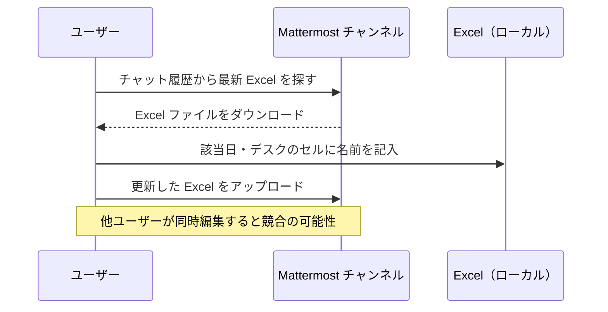
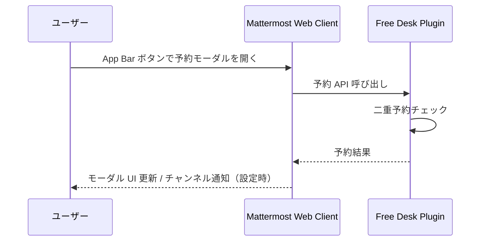

# 要件定義書

## ドキュメント情報

| 項目 | 内容 |
|------|------|
| プロジェクト名 | Mattermost Free Desk Reservation Plugin |
| 推奨リポジトリ名 | `mattermost-plugin-freedesk` |
| プラグイン ID | `com.github.taku-devjp.freedesk` |
| バージョン | 0.1.0 |
| 作成日 | 2026-08-06 |
| ステータス | 確定 |

---

## 1. 背景・目的

### 1.1 背景

社内のフリーデスク（ホットデスク）予約は、現在 Mattermost チャンネル上で Excel シートを共有し、予約者がセルに直接名前を書き込む運用を行っている。予約状況を確認・更新するたびに、チャット内の最新 Excel ファイルをダウンロードする必要があり、以下の問題が発生している。

- 常に最新ファイルを探す手間がかかる
- 同時編集による上書き・競合が起きやすい
- 予約状況の一覧性が低い

### 1.2 目的

Mattermost プラグインとしてフリーデスク予約機能を提供し、Excel による手動運用を廃止する。ユーザーは Mattermost 上で予約の確認・作成・取消を完結できるようにする。

### 1.3 成功基準

- Excel ファイルのダウンロードなしで、当日を含む約 2 か月分の予約状況を確認できる
- 予約の作成・取消が 30 秒以内に完了できる
- 同一デスク・同一日の二重予約がシステム上防止される
- 既存の Mattermost 認証・権限体系を利用し、別途ログインが不要

---

## 2. スコープ

### 2.1 対象（In Scope）

| 区分 | 内容 |
|------|------|
| 予約管理 | 日単位でのフリーデスク予約・取消（対象: **7 席**） |
| 一覧表示 | 日付 × デスクのマトリクス表示（行 = 日付、列 = デスク名）、空き状況の確認 |
| 通知 | 予約・取消時のチャンネル投稿（設定可能） |
| 管理機能 | デスクの登録・編集・無効化（モーダル内管理タブ）、予約代理取消 |
| 操作手段 | App Bar ボタン（画面右上）→ **モーダル**（予約タブ / 管理タブ） |
| 初期データ | プラグイン初回有効化時に 7 席を自動登録 |
| データ永続化 | Mattermost プラグイン DB（専用テーブル） |

### 2.2 対象外（Out of Scope）— 初版

| 区分 | 内容 | 備考 |
|------|------|------|
| 半日・時間帯予約 | AM/PM 等の時間分割 | 初版は終日（1 日 1 デスク 1 人） |
| フロアマップ UI | 座席配置図上での選択 | 将来拡張で検討 |
| 多拠点・多チーム | 拠点ごとの独立管理 | 初版は 1 チーム 1 拠点想定 |
| Excel インポート | 既存 Excel からの一括移行 | 再度各ユーザーで再予約想定 |
| スラッシュコマンド | `/freedesk` 等のコマンド操作 | v0.2 以降（FR-041） |
| RHS（右パネル）UI | 右サイドパネルでの予約表示 | モーダルで代替 |
| モバイル対応 | スマートフォン・タブレット向け UI | PC ブラウザのみ想定 |

---

## 3. ユーザーとロール

| ロール | 説明 | 主な操作 |
|--------|------|----------|
| 一般ユーザー | Mattermost にログイン済みの社員 | 空き状況確認、予約作成・取消、マトリクス上で自分の予約を確認 |
| プラグイン管理者 | プラグイン設定で指定された管理ユーザー | デスク登録・編集・無効化、予約代理取消、予約管理 |
| Mattermost System Admin | Mattermost システム管理者 | プラグイン有効化、設定変更、システム管理 |

---

## 4. 現状業務フロー（As-Is）



---

## 5. 目標業務フロー（To-Be）



---

## 6. 機能要件

### 6.1 予約機能（FR-001〜FR-004）

| ID | 要件 | 優先度 |
|----|------|--------|
| FR-001 | ユーザーは、指定日・指定デスクを予約できる（対象日は「今日」から予約可能期間内。実行前に確認ダイアログを表示。詳細は 6.7・FR-047） | Must |
| FR-002 | ユーザーは、自分が作成した予約を取消できる（対象日は「今日」以降。実行前に確認ダイアログを表示。詳細は 6.7・FR-047） | Must |
| FR-003 | 同一のデスク・同一日付に、異なるユーザーを含め 2 件以上の予約を登録できない（排他制御） | Must |
| FR-004 | ユーザーは、1 日に複数デスクを予約できない（1 日 1 デスク制限。デフォルト ON。Mattermost System Admin がプラグイン設定で ON/OFF 可能） | Should |

### 6.2 参照機能（FR-010〜FR-012）

| ID | 要件 | 優先度 |
|----|------|--------|
| FR-010 | 日付 × デスクのマトリクス（行 = 日付、列 = デスク名）で空き・予約済みを表示できる。予約者は Mattermost の**フルネーム**で表示する。未設定であればユーザー名を使用 | Must |
| FR-011 | 表示期間および予約可能期間は同一とし、「今日から約 2 か月先」まで（Mattermost System Admin がプラグイン設定で変更可能） | Must |
| FR-012 | マトリクス上で自分の予約セルをハイライト表示できる | Must |

### 6.3 通知機能（FR-020〜FR-021）

| ID | 要件 | 優先度 |
|----|------|--------|
| FR-020 | 予約・取消時に、設定チャンネルへ投稿できる（Mattermost System Admin がプラグイン設定で ON/OFF 可能）。通知先未設定または OFF の場合は投稿をスキップし、予約 UI の利用には影響しない | Must |
| FR-021 | 投稿には予約者名・デスク名・日付を含める | Must |

### 6.4 管理機能（FR-030〜FR-032）

| ID | 要件 | 優先度 |
|----|------|--------|
| FR-030 | プラグイン管理者はモーダル内の**管理タブ**からデスク（名称・表示順・有効/無効）を CRUD できる。初版の管理対象は社員フリー1〜3、フリーデスク4〜7 の **7 席**（名称のみ異なり予約ルールは同一）。初回有効化（`OnActivate`）時に 7 席を自動登録する | Must |
| FR-031 | プラグイン管理者は、マトリクス上の**他人の予約済みセル**をクリックし、確認ダイアログで確定後に予約を代理取消できる（FR-047） | Must |
| FR-032 | Mattermost System Admin が通知先チャンネル ID 等をプラグイン設定で指定できる（通知投稿専用。UI 表示条件とはしない） | Must |

### 6.5 UI / 操作（FR-040〜FR-047）

| ID | 要件 | 優先度 |
|----|------|--------|
| FR-040 | 画面右上 App Bar のプラグインボタンから、**モーダル**に予約 UI（マトリクス）を表示できる。通知先チャンネルの設定有無に依存しない。チャット欄はモーダル表示中は隠れて問題ない | Must |
| FR-041 | スラッシュコマンド `/freedesk` で主要操作ができる | Should（v0.1.0 では対象外） |
| FR-042 | 空きセル（今日以降）をクリックすると**予約確認ダイアログ**を表示し、ユーザーが確定した場合のみ予約を実行する（FR-047） | Must |
| FR-043 | 自分の予約済みセル（今日以降）をクリックすると**取消確認ダイアログ**を表示し、ユーザーが確定した場合のみ取消を実行する（FR-047） | Must |
| FR-044 | マトリクス UI は列ヘッダー（デスク名）を固定する。7 席は PC 画面幅で**横スクロールなし**で表示できること（不足時のみ横スクロール可） | Must |
| FR-045 | マトリクス UI の日付行は **1 か月単位** でページング表示する | Must |
| FR-046 | プラグイン管理者にはモーダル内に**管理タブ**を表示する（一般ユーザーには非表示） | Must |
| FR-047 | **予約作成**および**予約取消**（本人の取消・管理者の代理取消を含む）は、いずれも API 実行前に確認ダイアログを表示し、ユーザーが確定（OK）した場合のみ処理を実行する | Must |

### 6.7 日付・時間ルール

| ID | 要件 | 優先度 |
|----|------|--------|
| FR-050 | タイムゾーンは **Asia/Tokyo 固定** とする | Must |
| FR-051 | 「今日」は Asia/Tokyo の **0:00** を境界として日付が切り替わる | Must |
| FR-052 | **昨日以前**の日付は予約・取消不可（マトリクス上は表示のみ） | Must |
| FR-053 | 土日祝日も予約可能（制限なし） | Must |

### 6.6 スラッシュコマンド仕様（案・v0.2 以降）

初版（v0.1.0）では実装しない。UI の入口は App Bar ボタンのみとする。

| コマンド | 説明 |
|----------|------|
| `/freedesk` | 予約 UI（モーダル）を開く |
| `/freedesk book <desk> <YYYY-MM-DD>` | 指定デスク・日付を予約 |
| `/freedesk cancel <YYYY-MM-DD>` | 指定日の自分の予約を取消 |
| `/freedesk list [YYYY-MM-DD]` | 指定日（省略時は今日）の全デスク状況を表示 |
| `/freedesk mine` | 自分の予約一覧を表示 |

---

## 7. 非機能要件

### 7.1 性能

| ID | 要件 |
|----|------|
| NFR-001 | 予約状況一覧 API の応答時間：p95 で 500ms 以内（デスク 7 席 × 1 か月分の日付想定） |
| NFR-002 | 同時予約リクエスト時、先着 1 件のみ成功させる |

### 7.2 可用性・運用

| ID | 要件 |
|----|------|
| NFR-010 | Mattermost サーバー再起動後も予約データが保持される |
| NFR-011 | プラグイン無効化・再有効化後もデータが保持される |
| NFR-012 | ログ出力：予約作成・取消・管理操作を INFO レベルで記録 |

### 7.3 セキュリティ

| ID | 要件 |
|----|------|
| NFR-020 | 全 API は Mattermost 認証済みユーザーのみアクセス可能 |
| NFR-021 | 他ユーザーの予約取消は、本人またはプラグイン管理者のみ可能 |
| NFR-022 | デスク管理・予約管理 API はプラグイン管理者のみ（プラグイン設定変更は Mattermost System Admin） |

### 7.4 互換性

| ID | 要件 |
|----|------|
| NFR-030 | Mattermost Server v9.0 以上をサポート |
| NFR-031 | クライアント：PC ブラウザ上の Mattermost Web Client のみ想定（モバイル非対応） |

---

## 8. 用語定義

| 用語 | 定義 |
|------|------|
| フリーデスク | 固定席を持たず、出社日に自由に使用するデスク |
| デスク | 予約対象となる座席。7 席は名称のみ異なり（社員フリー1〜3、フリーデスク4〜7）、予約ルールは同一 |
| 予約 | 特定ユーザーが特定デスクを特定日に使用する権利 |
| 予約モーダル | App Bar から開く画面中央のオーバーレイ UI。予約マトリクスおよび管理タブの表示先 |
| App Bar | Mattermost Web Client 画面右上のグローバルな操作エリア。プラグインボタンの配置場所 |
| マトリクス表示 | 行 = 日付、列 = デスク名 の表形式 UI（現行 Excel と同じ構成） |
| セル | マトリクス上の日付 × デスクの 1 マス |

---

## 9. 技術方針

| 項目 | 方針 |
|------|------|
| ベースリポジトリ | [mattermost/mattermost-plugin-starter-template](https://github.com/mattermost/mattermost-plugin-starter-template) |
| サーバー言語 | Go |
| Web アプリ | TypeScript / React（Mattermost Web App Plugin API） |
| データストア | Mattermost プラグイン DB（専用テーブル、`pluginapi` Store） |
| HTTP ルーティング | gorilla/mux（starter template 準拠） |
| 参考プラグイン | [mattermost-plugin-agenda](https://github.com/mattermost-community/mattermost-plugin-agenda)（スラッシュコマンド・チャンネル連携） |

---

## 10. 画面イメージ（概要）

### 10.1 UI の入口（App Bar → モーダル）

```
                    App Bar（画面右上・常時表示）→ [📅]
┌─────────────────────────────────────────────────────┐
│  Mattermost Web Client（背景）                       │
│         ┌─────────────────────────────────┐         │
│         │  フリーデスク予約（モーダル）    │         │
│         │  [予約タブ] [管理タブ]*         │         │
│         │  （予約マトリクス）              │         │
│         └─────────────────────────────────┘         │
└─────────────────────────────────────────────────────┘
  * 管理タブはプラグイン管理者のみ表示
```

- App Bar ボタンを押すと**モーダル**が開き、予約 UI を表示する
- モーダル表示中はチャット欄が隠れても問題ない（PC 専用・予約操作に集中）
- 通知先チャンネルの設定有無とは独立して常に利用可能
- モーダルは閉じる（× / Esc / 背景クリック等）操作を提供する

### 10.2 予約マトリクス（モーダル・予約タブ）

現行 Excel と同様、**行 = 日付、列 = デスク名** とする。7 席は**名称のみ異なり、予約ルールは同一**。

**管理対象デスク（7 席・初回有効化時に自動登録）**

| # | デスク名 |
|---|----------|
| 1 | 社員フリー1 |
| 2 | 社員フリー2 |
| 3 | 社員フリー3 |
| 4 | フリーデスク4 |
| 5 | フリーデスク5 |
| 6 | フリーデスク6 |
| 7 | フリーデスク7 |

**UI 仕様**

- モーダルは画面幅のおおむね **80% 以上** を確保し、7 席を横スクロールなしで表示することを目指す
- 列ヘッダー（デスク名）を固定
- 日付行は **1 か月単位** でページング（前月 / 翌月で切り替え）。日付方向は縦スクロール
- 予約者は Mattermost **フルネーム** で表示。未設定の場合はユーザー名を使用
- **自分の予約セル**はハイライト表示（FR-012）

**表示イメージ**

```
         [< 前月]  2026年8月  [翌月 >]

              社員フリー1  社員フリー2  社員フリー3  フリーデスク4  フリーデスク5  フリーデスク6  フリーデスク7
8/6(水)         田中        （空）       佐藤         （空）        （空）        （空）         山田 ★自分
8/7(木)        （空）        鈴木              （空）
...
```

**セル操作**

いずれの操作も、確定前に **FR-047 の確認ダイアログ** を経由する。

| セル状態 | 一般ユーザー | プラグイン管理者 |
|----------|--------------|------------------|
| 空き（今日以降） | クリック → **予約確認ダイアログ** → 確定で予約 | 同左 |
| 自分の予約（今日以降） | クリック → **取消確認ダイアログ** → 確定で取消 | 同左 |
| 他人の予約 | 表示のみ | クリック → **取消確認ダイアログ** → 確定で代理取消 |
| 昨日以前 | 表示のみ（操作不可） | 表示のみ（操作不可） |

**確認ダイアログに含める情報（例）**

| 操作 | 表示内容 |
|------|----------|
| 予約 | デスク名、日付、「予約しますか？」 |
| 取消（本人） | デスク名、日付、「予約を取り消しますか？」 |
| 代理取消 | デスク名、日付、予約者名、「代理で予約を取り消しますか？」 |

### 10.3 管理タブ（モーダル・プラグイン管理者のみ）

- モーダル内の**管理タブ**からデスクの CRUD（名称・表示順・有効/無効）を行う
- 一般ユーザーには管理タブを表示しない

---

## 11. リリース計画（案）

| フェーズ | 内容 |
|----------|------|
| v0.1.0（MVP） | 予約 CRUD、App Bar → モーダル マトリクス UI、7 席自動登録、デスク管理（管理タブ）、チャンネル通知 |
| v0.2.0 | スラッシュコマンド |
| v0.3.0 | 半日予約、複数拠点、フロアマップ |

---

## 12. リスクと対策

| リスク | 影響 | 対策 |
|--------|------|------|
| 同時予約の競合 | 二重予約 | DB ユニーク制約 + Compare-And-Set |
| デスク数増加による性能劣化 | UI 遅延 | 現状 7 席想定。日付の 1 か月ページング、インデックス設計で対応 |

---
